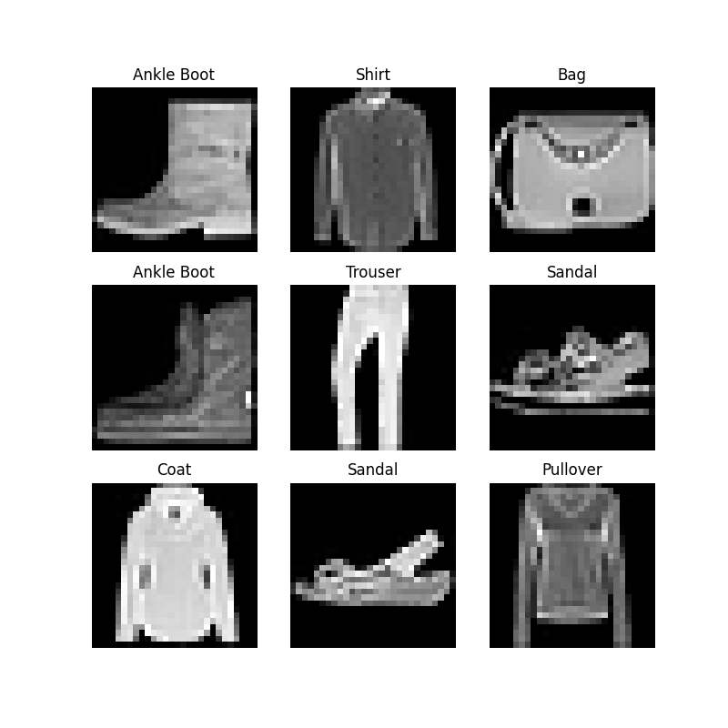
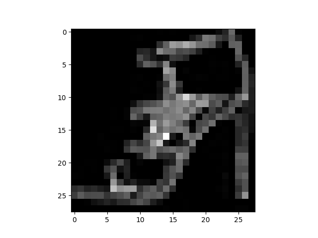

# Loading and normalizing datasets 加载和规范化数据集


[TOC]


# Datasets & DataLoaders 数据集和数据加载器


用于处理数据样本的代码可能会变得混乱且难以维护；理想情况下，我们希望数据集代码与模型训练代码分离，以获得更好的可读性和模块化性。PyTorch 提供了两个数据原语：`torch.utils.data.DataLoader`和`torch.utils.data.Dataset` ，允许您使用预加载的数据集以及您自己的数据。 `Dataset`存储样本及其相应的标签，并`DataLoader`围绕 `Dataset`进行迭代，以方便访问样本。

PyTorch 域库提供了许多预加载的数据集（例如 FashionMNIST）。这些数据集是`torch.utils.data.Dataset`的子类。并且，对于特定数据，实现特定的函数。它们可用于对您的模型进行原型设计和基准测试。您可以在这里找到它们：[图像数据集](https://pytorch.org/vision/stable/datasets.html)、 [文本数据集](https://pytorch.org/text/stable/datasets.html)和 [音频数据集](https://pytorch.org/audio/stable/datasets.html)

# Loading a Dataset 加载数据集


以下是如何从 TorchVision 加载[Fashion-MNIST](https://research.zalando.com/project/fashion_mnist/fashion_mnist/)数据集的示例。Fashion-MNIST 是 Zalando 论文的图像数据集。这个数据集由 60,000 个训练样本和 10,000 个测试样本组成。每个样本包含一个 28×28 灰度图像和来自 10 个类别之一的关联标签。

- 每张图像的高度为 28 像素，宽度为 28 像素，总共 784 像素。 
- 这 10 个类别表示图像的类型，例如：T 恤/上衣、裤子、套头衫、连衣裙、包、踝靴等. 
- 灰度像素的值介于 0 到 255 之间，用于测量黑白图像的强度。强度值从白色增加到黑色。例如：白色为 0，黑色为 255。

我们使用以下参数，来加载[FashionMNIST Dataset](https://pytorch.org/vision/stable/datasets.html#fashion-mnist)：

  - `root` 是存储训练/测试数据的路径，

- `train` 指定训练或测试数据集，

-  `download=True` 如果`root` 上没有数据，则从 Internet 下载数据。

- `transform`和`target_transform` 指定特征和标签的转换。

```python
%matplotlib inline
import torch
from torch.utils.data import Dataset
from torchvision import datasets
from torchvision.transforms import ToTensor, Lambda
import matplotlib.pyplot as plt

training_data = datasets.FashionMNIST(
    root="data",
    train=True,
    download=True,
    transform=ToTensor()
)

test_data = datasets.FashionMNIST(
    root="data",
    train=False,
    download=True,
    transform=ToTensor()
)
```


# Iterating and Visualizing the Dataset 迭代和可视化数据集


我们可以像列表一样手动索引`Datasets`：`training_data[index]`。我们用`matplotlib`来可视化训练数据中的一些样本。

```python
labels_map = {
    0: "T-Shirt",
    1: "Trouser",
    2: "Pullover",
    3: "Dress",
    4: "Coat",
    5: "Sandal",
    6: "Shirt",
    7: "Sneaker",
    8: "Bag",
    9: "Ankle Boot",
}
figure = plt.figure(figsize=(8, 8))
cols, rows = 3, 3
for i in range(1, cols * rows + 1):
    sample_idx = torch.randint(len(training_data), size=(1,)).item()
    img, label = training_data[sample_idx]
    figure.add_subplot(rows, cols, i)
    plt.title(labels_map[label])
    plt.axis("off")
    plt.imshow(img.squeeze(), cmap="gray")
plt.show()
```
Out:



# Creating a Custom Dataset for your files 为您的文件创建自定义数据集

自定义 Dataset 类必须实现三个函数：`__init__`、`__len__`和`__getitem`__。看看这个实现：FashionMNIST 图像存储在目录`img_dir`中，它们的标签单独存储在CSV 文件`annotations_file`中。


在接下来的部分中，我们将详细介绍每个函数中实现的功能。

```python
import os
import pandas as pd
from torchvision.io import read_image

class CustomImageDataset(Dataset):
    def __init__(self, annotations_file, img_dir, transform=None, target_transform=None):
        self.img_labels = pd.read_csv(annotations_file)
        self.img_dir = img_dir
        self.transform = transform
        self.target_transform = target_transform

    def __len__(self):
        return len(self.img_labels)

    def __getitem__(self, idx):
        img_path = os.path.join(self.img_dir, self.img_labels.iloc[idx, 0])
        image = read_image(img_path)
        label = self.img_labels.iloc[idx, 1]
        if self.transform:
            image = self.transform(image)
        if self.target_transform:
            label = self.target_transform(label)
        return image, label
```


## \__init__

`__init__` 函数在实例化 Dataset 对象时运行一次。我们初始化包含图像、注释文件和两种转换的目录（下一节将更详细地介绍）。

```python
tshirt1.jpg, 0
tshirt2.jpg, 0
......
ankleboot999.jpg, 9
```

```python
def __init__(self, annotations_file, img_dir, transform=None, target_transform=None):
    self.img_labels = pd.read_csv(annotations_file)
    self.img_dir = img_dir
    self.transform = transform
    self.target_transform = target_transform
```


## \__len__

`__len__` 函数返回数据集中的样本数。

例子：

```python
def __len__(self):
    return len(self.img_labels)
```


## \__getitem__

`__getitem__` 函数从数据集加载并返回给定索引`idx`的的样本。基于索引，它识别图像在磁盘上的位置，使用`read_image` 将其转换为张量，从 `self.img_labels`中的 csv 数据中检索相应的标签，调用它们的转换函数（如果适用），并以元组方式返回张量图像和相应的标签。

```python
def __getitem__(self, idx):
    img_path = os.path.join(self.img_dir, self.img_labels.iloc[idx, 0])
    image = read_image(img_path)
    label = self.img_labels.iloc[idx, 1]
    if self.transform:
        image = self.transform(image)
    if self.target_transform:
        label = self.target_transform(label)
    return image, label
```


# Preparing your data for training with DataLoaders 使用 DataLoaders 准备数据以进行训练

`Dataset`检索我们的数据集中一个样本的特征和标签。在训练模型时，我们通常希望以 “minibatches”方式传递样本，在每个epcoch重新整理数据以减少模型过度拟合，并使用 Python的`multiprocessing`来加速数据检索。

在机器学习中，您需要指定数据集中的特征和标签。输入特征，输出标签。我们训练特征，然后训练模型来预测标签。
- 特征是图像像素中的图案
- 标签是我们的 10 类类型：T 恤、凉鞋、连衣裙等

`DataLoader`是一个可迭代对象，它通过一个简单的 API 为我们抽象了这种复杂性。要使用 Dataloader，我们需要设置以下参数： 

- **data** 将用于训练模型的训练数据，以及评估模型的测试数据 
- **batch size** 每批中要处理的记录数 
- **shuffle** 按索引随机抽取数据样本

```python
from torch.utils.data import DataLoader

train_dataloader = DataLoader(training_data, batch_size=64, shuffle=True)
test_dataloader = DataLoader(test_data, batch_size=64, shuffle=True)
```


# Iterate through the DataLoader 遍历 DataLoader

我们已将该数据集加载到 `DataLoader` 中，并且可以根据需要迭代数据集。下面的每次迭代都会返回一批`train_features`和`train_labels`（`batch_size=64`分别包含特征和标签）。因为我们指定了`shuffle=True`，所以在迭代所有批次后，数据将被打乱（为了更细粒度地控制数据加载顺序，请查看[Samplers](https://pytorch.org/docs/stable/data.html#data-loading-order-and-sampler)）。

```python
# Display image and label.
train_features, train_labels = next(iter(train_dataloader))
print(f"Feature batch shape: {train_features.size()}")
print(f"Labels batch shape: {train_labels.size()}")
img = train_features[0].squeeze()
label = train_labels[0]
plt.imshow(img, cmap="gray")
plt.show()
label_name = list(labels_map.values())[label]
print(f"Label: {label_name}")
```




```python
Feature batch shape: torch.Size([64, 1, 28, 28])
Labels batch shape: torch.Size([64])
Label: Ankle Boot
```

# Normalization 正则化

正则化是一种常见的数据预处理技术，用于缩放或转换数据，以确保每个特征的学习贡献相等。例如，灰度图像中的每个像素的值在0到255之间，这是特征。如果一个像素值为17，另一个像素为197。就会出现像素重要性分布不均匀的情况，因为较高的像素量会使学习发生偏差。正则化会改变数据的范围，而不会扭曲其特征之间的区别。进行这种预处理是为了避免： 

- 预测精度降低 
- 模型学习困难 
- 特征数据范围的不利分布

## Transforms 转换

数据并不总是以训练机器学习算法所需的最终处理形式出现。我们使用**transforms**来操作数据并使其适合训练。

所有 TorchVision 数据集都有两个参数（`transform` 用于修改特征，`target_transform` 用于修改标签），它们接受包含转换逻辑的可调用对象。 `torchvision.transforms` 模块提供了几种开箱即用的常用转换。

FashionMNIST特征采用PIL图像格式，标签为整数。对于训练，我们需要将特征作为归一化张量，将标签作为单热编码张量。为了进行这些转换，我们将使用 `ToTensor` 和 `Lambda`。

```python
from torchvision import datasets
from torchvision.transforms import ToTensor, Lambda

ds = datasets.FashionMNIST(
    root="data",
    train=True,
    download=True,
    transform=ToTensor(),
    target_transform=Lambda(lambda y: torch.zeros(10, dtype=torch.float).scatter_(0, torch.tensor(y), value=1))
)
```

## ToTensor()

`ToTensor` 将 PIL 图像或 NumPy `ndarray` 转换为 `FloatTensor` 并将图像的像素强度值缩放到 [0., 1.]范围。

## Lambda transforms

Lambda transforms 应用任何用户定义的 lambda 函数。在这里，我们定义一个函数将整数转换为 one-hot 编码张量。它首先创建一个大小为 10（数据集中的标签数量）的零张量，并调用 scatter，它在标签 y 给定的索引上分配 *value=1*。您还可以使用 *torch.nn.function.one_hot* 作为另一个选项来执行此操作。

# 知识检查

1.PyTorch `DataSet` 和 PyTorch `DataLoader` 之间有什么区别

`DataSet`  按设计用于检索单个数据项，而 `DataLoader`  按设计用于处理批量数据。

2.PyTorch 中的转换旨在：

 对数据执行某些操作，使其适用于训练。

# Further Reading 进一步阅读

- [torch.utils.data API](https://pytorch.org/docs/stable/data.html)

# References 参考文献

使用 PyTorch 进行机器学习的简介 - Training | Microsoft Learn

[使用 PyTorch 进行机器学习的简介 - Training | Microsoft Learn](https://learn.microsoft.com/zh-cn/training/modules/intro-machine-learning-pytorch/)

# Github

storm-ice/PyTorch_Fundamentals

[storm-ice/PyTorch_Fundamentals](https://github.com/storm-ice/PyTorch_Fundamentals/tree/main)
